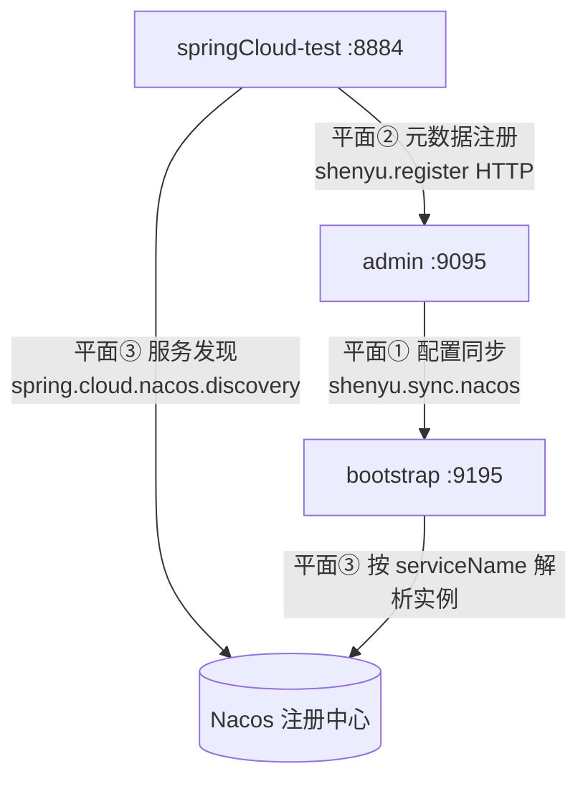
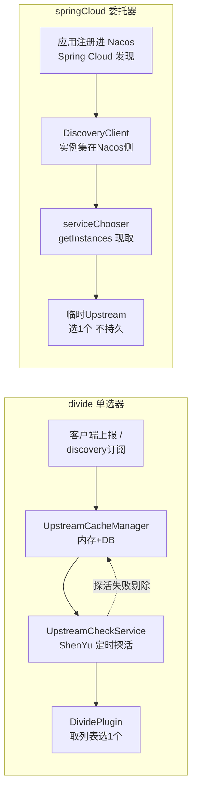

# ShenYu 2.6.1 + Nacos 2.5.2 SpringCloud 接入分析总结

> 会话时间：2026-07-17
> 范围：ShenYu 2.6.1（admin/gateway）+ Nacos 2.5.2 + SpringCloud 接入的可行性、配置核对、以及 divide 与 springCloud 插件本质差异的源码级分析。
> 结论先行：**当前仓库 `shenyu-client-java` 不含任何 SpringCloud 案例/客户端模块**；在 2.6.1 上接入 SpringCloud 走的是「springCloud 插件 + Spring Cloud 原生服务发现」路线，与之前做通的 divide + Nacos discovery 是两条正交路径。

---

## 1. 项目现状核查

| 检查项 | 结果 |
|---|---|
| 顶层模块数 | 14 个（`shenyu-client-core` / `shenyu-client-http` / `shenyu-registry-api` / `shenyu-spring-boot-starter-client` 等） |
| SpringCloud 客户端模块 | **无** `shenyu-client-spring-cloud`；`shenyu-client-http` 下仅 `shenyu-client-springmvc` |
| `@ShenyuSpringCloudClient` 注解 | 全仓零命中 |
| HTTP 客户端注册类型 | 恒为 `RpcTypeEnum.HTTP`（`SpringMvcClientEventListener` 131/155/272、`SpringMvcApiMetaRegister` 89/151） |
| 示例 demo | `shenyu-http-demo` / `shenyu-sign-demo*` 均为普通 Spring MVC，无 spring-cloud/eureka/nacos-discovery 依赖 |
| 仓库实际版本 | client SDK = `2.7.0.1-jdk8-SNAPSHOT`（revision 21）；**admin/gateway = 2.6.1**；registry-nacos = 2.6.1 |

**结论**：SpringCloud 客户端 starter（`shenyu-spring-boot-starter-client-spring-cloud`）与官方示例（`shenyu-examples-springcloud`）在**主仓 `apache/shenyu`**，不在本 `shenyu-client-java` 子仓；本仓的 `shenyu-client-springmvc` 是其复用的底座（注解扫描 + 注册逻辑），但注册类型是 HTTP 而非 springCloud。

---

## 2. 用户贴出的 2.6.1 + Nacos 配置核对结果

总体路线正确：Nacos 同时承担 **admin↔bootstrap 数据同步**（`shenyu.sync.nacos`）与 **SpringCloud 服务发现**（`spring.cloud.nacos.discovery`），用的是 2.6.1 的 springCloud 插件而非 2.7 的 `shenyu.discovery`。但贴出的配置有 4 处需修正：

| # | 严重度 | 问题 | 修正 |
|---|---|---|---|
| 1 | 🔴 | 示例应用 `springCloud-test` 缺整个 `shenyu:` 块 | 必须补 `shenyu.register`（注册到 admin）+ `shenyu.client.springCloud.props`（contextPath），否则 admin 无选择器/规则，网关不路由 |
| 2 | 🔴 | admin 整体覆盖 `shenyu:` 块 | 会丢失 `register/ldap/jwt/shiro/dashboard`，admin 起不来。只改 `shenyu.sync` |
| 3 | 🟡 | admin 顶层 `shenyu.nacos` 非法键 | 2.6.1 真实 admin yaml 只有 `shenyu.sync.nacos`，无顶层 `shenyu.nacos`。删掉，启用 `shenyu.sync.nacos` |
| 4 | 🟡 | Nacos `namespace` 取值 | 必须核对真实 namespaceId（Nacos 控制台建命名空间可手填 ID，非强制 UUID）。在 admin-sync / bootstrap-sync / bootstrap-discovery / app-discovery 四处保持一致 |

补充依赖要求：
- 应用：`shenyu-spring-boot-starter-client-spring-cloud` + `spring-cloud-starter-alibaba-nacos-discovery` + `@ShenyuSpringCloudClient` 注解
- 网关 bootstrap：`shenyu-spring-boot-starter-plugin-springcloud` + `shenyu-spring-boot-starter-plugin-httpclient` + `spring-cloud-commons` + `spring-cloud-starter-alibaba-nacos-discovery`
- admin 插件管理需**手动启用 springCloud 插件**

---

## 3. Nacos 的本质逻辑：同一 Nacos，三个平面

> 配置出错几乎都源于把这三个"平面"混为一谈。它们只是共用一个 Nacos 地址和 namespace，但存的东西、走的通道、解决的问题各不相同。



| 平面 | 配置键 | 作用 | 存什么 |
|---|---|---|---|
| ① 配置同步 | `shenyu.sync.nacos` | admin 把插件/选择器/规则写进 Nacos 配置中心，bootstrap 订阅 | 配置数据（替代 websocket） |
| ② 元数据注册 | `shenyu.register`（走 HTTP，**不经 Nacos**） | 应用 `@ShenyuSpringCloudClient` 上报 API 路径给 admin，admin 生成选择器/规则 | API 路径元数据 |
| ③ 服务发现 | `spring.cloud.nacos.discovery` | 应用注册实例进 Nacos；bootstrap 用 LoadBalancer 按 serviceName 解析真实实例 | 服务实例列表（naming） |

**核心约束**：三个平面的 `namespace` 必须四处一致（`ShenyuRegisterCenter`），但存的内容完全不同（config / 元数据 / naming）。

---

## 4. divide（单选器）vs springCloud（委托器）源码级对照

> 基于 2.6.1 真实源码：`DividePlugin` / `SpringCloudPlugin` / `ShenyuSpringCloudServiceChooser`。

**DividePlugin.doExecute（关键行）**
```java
List<Upstream> upstreamList =
    UpstreamCacheManager.getInstance().findUpstreamListBySelectorId(selector.getId()); // ① 取持久化列表
if (CollectionUtils.isEmpty(upstreamList)) { ... CANNOT_FIND_HEALTHY_UPSTREAM_URL ... }
Upstream upstream = LoadBalancerFactory.selector(upstreamList, ruleHandle.getLoadBalance(), ip); // ② 从列表挑一个
```

**SpringCloudPlugin.doExecute（关键行）**
```java
SpringCloudSelectorHandle h = SpringCloudPluginDataHandler.SELECTOR_CACHED.get().obtainHandle(selector.getId());
String serviceId = h.getServiceId(); // ① 只取服务名
Upstream upstream = serviceChooser.choose(serviceId, selector.getId(), ip, ruleHandle.getLoadBalance()); // ② 委托别人按名查实例
```

**ShenyuSpringCloudServiceChooser.choose（关键行）**
```java
private List<ServiceInstance> getServiceInstance(String serviceId) {
    if (empty(ServiceInstanceCache.getServiceInstance(serviceId)))
        return discoveryClient.getInstances(serviceId); // ← 直接问 Spring Cloud 的 DiscoveryClient
    return ServiceInstanceCache.getServiceInstance(serviceId);
}
// buildUpstream: 把 ServiceInstance 的 uri 临时包成 Upstream（weight=50，无持久化）
```

### 对照表

| 维度 | divide 插件 · 单选器 | springCloud 插件 · 委托器 |
|---|---|---|
| 上游列表持有者 | ShenYu（`UpstreamCacheManager` 内存 + DB） | Spring Cloud 注册中心，网关不持有 |
| 列表来源 | ① 客户端 HTTP 元数据上报；② `shenyu.discovery` 订阅 | 应用注册进 Nacos → `DiscoveryClient` 实时拉取 |
| 是否持久化 upstream | 是（内存 + 入库，注册态） | 否（每次请求现查，临时 `buildUpstream` weight=50，不入库） |
| 健康探活 | ShenYu 自管（`UpstreamCheckService` 定时探活） | 交给 Nacos/Spring Cloud，ShenYu 不探活 |
| 选路时数据 | 缓存中的 upstream 列表（可能陈旧） | `DiscoveryClient` 当前返回的活实例集（最新） |
| 负载均衡执行者 | ShenYu `LoadBalancerFactory` | 先 `DiscoveryClient` 取活集 → **仍用** ShenYu `LoadBalancerFactory` 在集内选 |
| selector 承载内容 | 一串 `Upstream`（ip:port/weight/status） | 仅 `serviceId`（= `spring.application.name`） |
| 上下线感知延迟 | 依赖探活周期/上报/同步（有延迟） | Nacos 事件近实时，下次请求即生效 |
| 与 `shenyu.discovery` 关系 | 直接消费（写入 `UpstreamCacheManager`） | 不用，直接用 Spring Cloud 发现 |
| bootstrap 依赖 | 元数据模式：无；discovery 模式：`shenyu-discovery-*` | **必须** `spring.cloud.nacos.discovery` |
| 典型报错 | `CANNOT_FIND_HEALTHY_UPSTREAM_URL` | `CANNOT_CONFIG_SPRINGCLOUD_SERVICEID` / `SPRINGCLOUD_SERVICEID_IS_ERROR` |
| 适用场景 | 普通 HTTP 服务、需精细控权重/探活/灰度 | 已是 Spring Cloud 微服务、复用注册中心原生治理 |

### 实例列表生命周期



**关键修正**：springCloud 只把「实例发现/探活」委托给 Spring Cloud（Nacos），**负载均衡算法仍是 ShenYu 的 `LoadBalancerFactory`**，并非交给 Ribbon/ReactiveLoadBalancer（源码未用 ReactiveLoadBalancer）。

**附加细节**：springCloud 的 `getGray()` 为真（灰度模式）时，会把发现的实例与 `UpstreamCacheManager` 的 divide upstream 求交集——两条路径的边界在此可融合。

---

## 5. 可落地的配置修正要点（摘录）

**admin（只改 `shenyu.sync`，保留其余 `shenyu.*`）**
```yaml
shenyu:
  sync:
    nacos:
      url: localhost:8848
      namespace: ShenyuRegisterCenter   # 必须是真实 namespaceId
      username:
      password:
```

**bootstrap**
```yaml
spring:
  cloud:
    discovery:
      enabled: true
    nacos:
      discovery:
        server-addr: 127.0.0.1:8848
        enabled: true
        namespace: ShenyuRegisterCenter
shenyu:
  sync:
    nacos:
      url: localhost:8848
      namespace: ShenyuRegisterCenter
```

**springCloud-test（补全缺失的 `shenyu:` 块）**
```yaml
shenyu:
  register:
    registerType: http
    serverLists: http://localhost:9095
    props:
      username: admin
      password: 123456
      nacosNameSpace: ShenyuRegisterCenter
  client:
    springCloud:
      props:
        contextPath: /springcloud
        addPrefixed: false
```

> 启动顺序：admin → bootstrap → springCloud-test（应用注册到 admin，admin 须先起）。

---

## 6. 下一步建议（待用户定方向）

1. **直接产出三份可粘贴的完整 yaml**（admin / bootstrap / springCloud-test）；
2. **在本项目仿 `shenyu-http-demo` 新建 `shenyu-springcloud-demo` 模块**（含正确 `shenyu.client.springCloud` 配置 + 依赖 + 注解），但 admin/bootstrap 仍须在主仓 `apache/shenyu` v2.6.1 调整；
3. **改用现有 HTTP/Spring MVC 客户端 + divide 插件**（若不需要 Spring Cloud 语义，通常更简单）。

---

## 附：本次会话验证过的源码事实

- 2.6.1 真实 admin yaml 无顶层 `shenyu.nacos`，只有 `shenyu.sync.nacos`（含 `url`/`namespace`/`username`/`password`）。
- 2.6.1 官方 `shenyu-examples-springcloud` 示例用 `ShenyuRegisterCenter` 作 namespaceId，`shenyu.register.props.nacosNameSpace` 与 `spring.cloud.nacos.discovery.namespace` 均为该值。
- `SpringCloudPlugin` 不维护 upstream 列表，selector 仅持 `serviceId`；`ShenyuSpringCloudServiceChooser` 经 `DiscoveryClient.getInstances` 现取实例，临时包成 `Upstream` 后用 ShenYu `LoadBalancerFactory` 挑选。
- `DividePlugin` 从 `UpstreamCacheManager` 取持久化 upstream 列表，用 `LoadBalancerFactory` 挑选；列表由元数据上报或 `shenyu.discovery` 注入。
